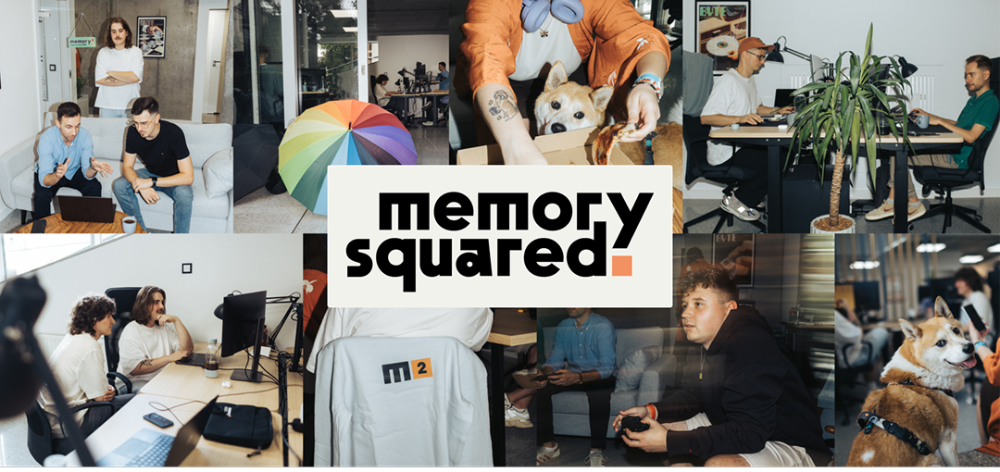

## We are Memory Squared 👋

We're a design-driven software development company building custom digital products and experiences: web applications, mobile apps, AI solutions, IoT solutions, and e-commerce platforms. 
We help startups, scaleups, and established organizations worldwide design, build, modernize, and scale digital products. Our team combines product strategy, UX/UI design, software engineering, and AI expertise to deliver solutions we're proud of.

## Our Services

* **Custom Software Development** - We design and build custom software tailored to unique business requirements.
* **Mobile App Development** - We create mobile applications for iOS and Android using both cross-platform and native technologies.
* **AI Development & Implementations** - We help organizations integrate artificial intelligence into products and operations.
* **Product Design** - Our design team transforms ideas into products users genuinely enjoy.
* **Team Augmentation** - We provide senior engineers, designers, and product specialists who seamlessly integrate with existing teams.

## Our Experience

Over the last three years, we have worked with clients from **17 countries** and delivered **30+ custom digital products** built from scratch.

We were recognized by **SoDA as the Growth Leader of the IT Industry 2025** and have earned **nearly 30 verified 5/5 reviews on Clutch**.

* Explore our portfolio and case studies: https://memory2.co/case-studies
* Read our client reviews: https://clutch.co/profile/memory-squared

## Technology Stack

* **Frontend:** TypeScript, JavaScript, React, Next.js, Tailwind CSS, Electron, GraphQL, REST APIs, Medusa.js
* **Backend:** Node.js, NestJS, Express.js, Laravel, Python, AWS, Google Cloud Platform (GCP), Docker, Serverless Architectures
* **Mobile:** React Native, Flutter, Swift, Kotlin
* **AI:** OpenAI, Gemini, Custom LLM Solutions, AI Workflow Automation
* **Design:** Figma, UX Design, UI Design, Design Systems, Product Discovery, Interactive Prototyping

## Let's Build Something Together

Whether you're launching a startup, modernizing existing software, developing an AI-powered product, or scaling an existing platform or team, we'd love to help.

🌐 https://memory2.co

📧 [contact@memory2.co](mailto:contact@memory2.co)
